# Function Block Environment

Function Block Environment 3 is an application for creating projects and modelling function blocks based on the IEC 61499. 

## Requirements:
 - Python3.8 or superior
 - Gnome Toolkit (GTK) 4
    
### How to install Python3/GTK4:
 1. Install Python:
    ```
    sudo apt update
    ```
    ```
    sudo apt install python3
    ```
 2. Install GTK4 and dependecies:
    ```
    sudo apt install python3-gi python3-gi-cairo gir1.2-gtk-4.0 gir1.2-adw-1 libgtk-4-dev libadwaita-1-dev
    ```

## To run FBE:
 1. Clone the FBE repository:
    ```
    git clone https://github.com/GASR-UDESC/FBE-3.git
    ```
 2. Open the application folder:
    ```
    cd FBE-3
    ```
 3. Run the script:
    ```
    ./run_fbe.sh
    ```

## How to use:
#### When no project is open, this is what the application looks like:
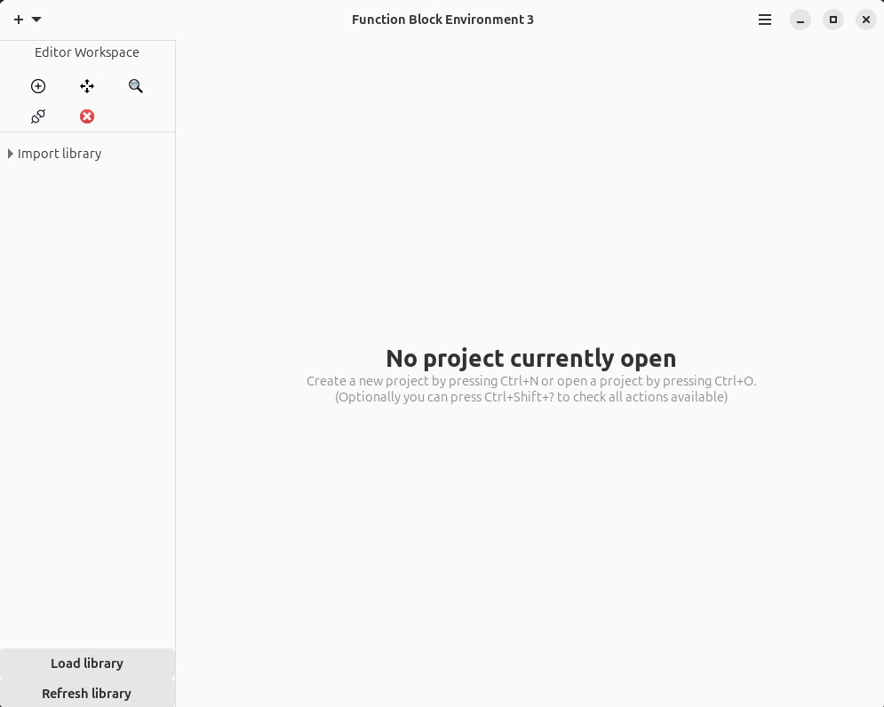

#### On the left side there's the editor workspace with basic tools like add, move, inspect, delete and connect. 
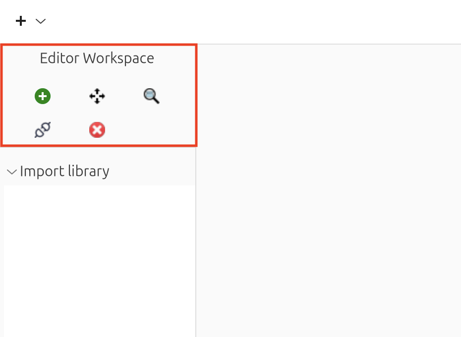

#### Right below there's the import library space, where you can load a library (e.g., home/user/documents/mylibrary) and also refresh once there's a change in the directory.
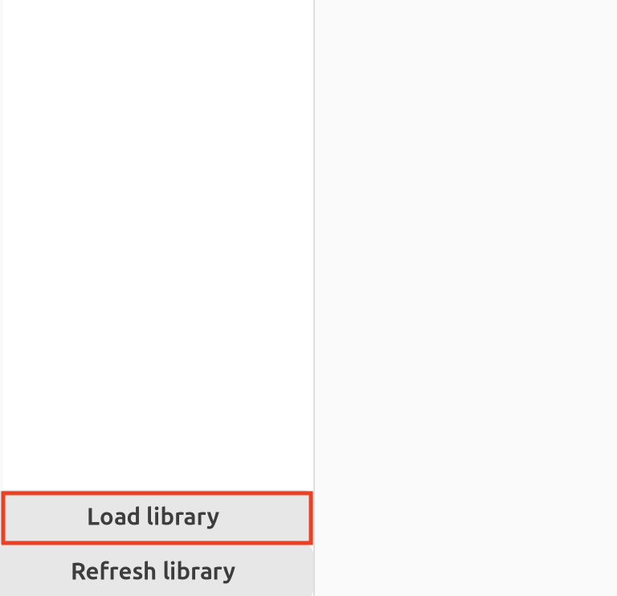
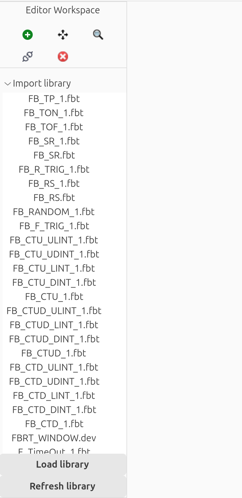

#### When adding a element to the project, remember to load a library (if the element has nested elements) to properly work.

#### The header bar also holds some important functions:
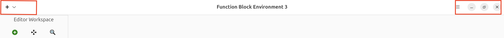

#### The left button presents the options to create, open, save, save as and export a project
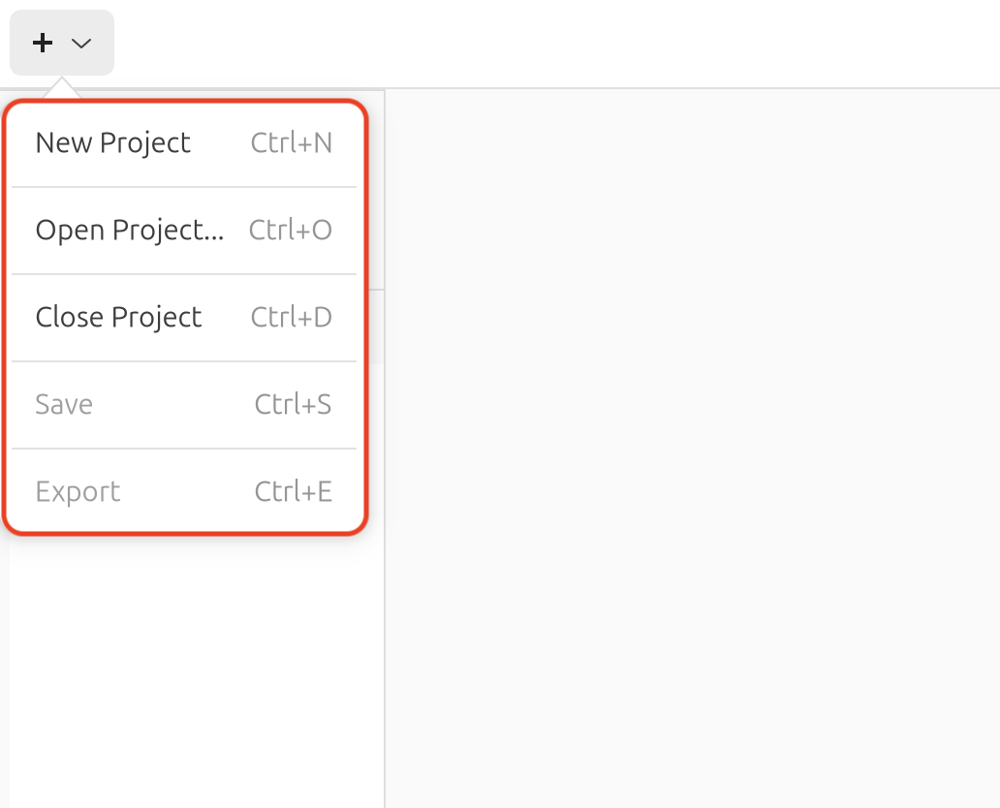

#### While the right button is where you can access preferences, keyboard shortcuts, read about FBE and also quit the application 
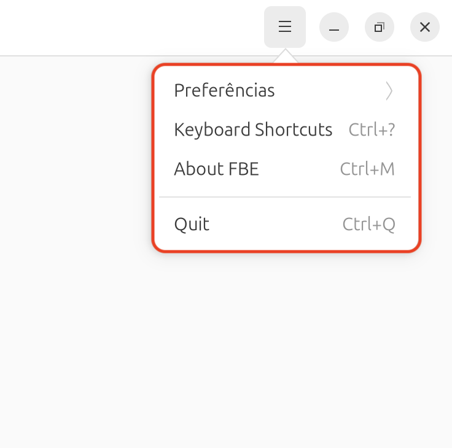


#### Upon creating a new project, it creates a blank unnamed system (which can refered as project) and application. The main page of every project it's the System Information. Through this page is possible to access every element of the project the user whishes to inspect by double clicking at element.
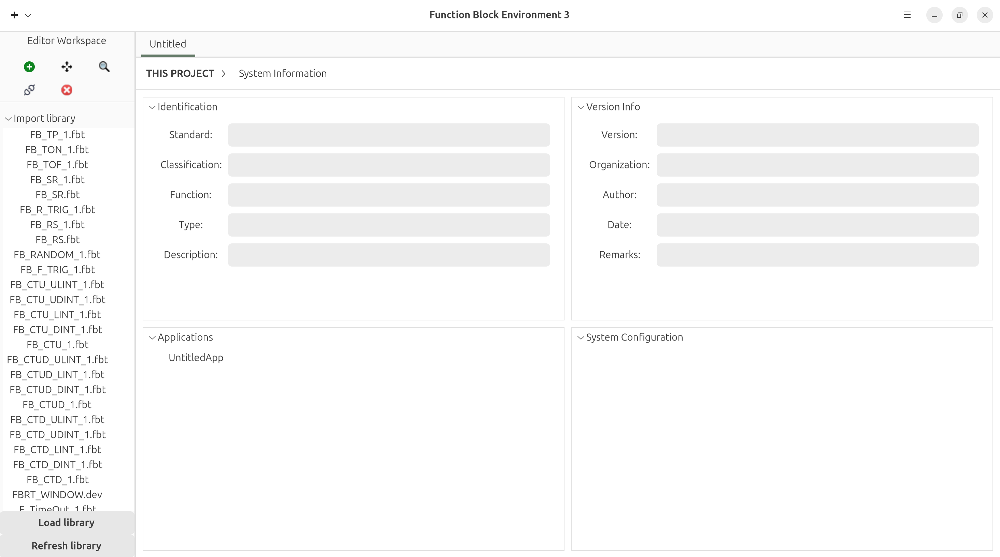

#### Most pages can be accessed by shortcuts, here's the most useful ones:
- System Information `Ctrl+G`
- System Configuration `Ctrl+H`
- Go to next application `Ctrl+D`
- Go to previous application `Ctrl+A`
- Go to last accessed page `Ctrl+B`
- Add type to application `Ctrl+Alt+N`
- Export project `Ctrl+E`

#### Elements with inside elements (e.g., Composite FB, FB's ECC, Device's FB Network) can be accessed by using the inspect tool and clicking on the element.
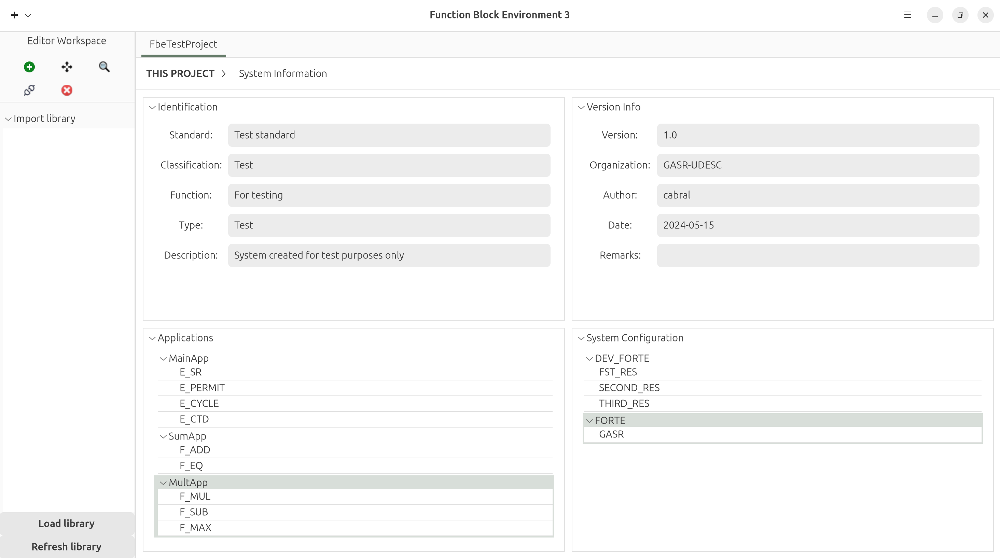
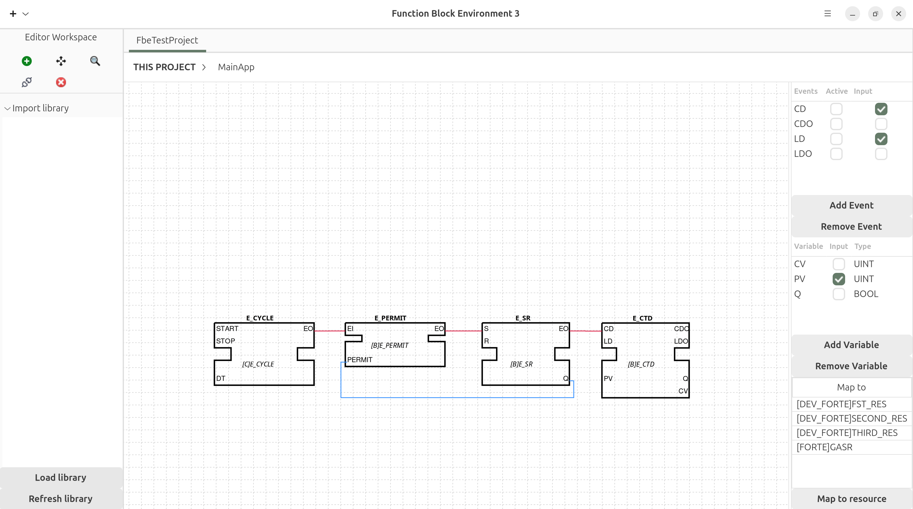

#### The whole project or part of it can be exported through the export page(Ctrl+E):
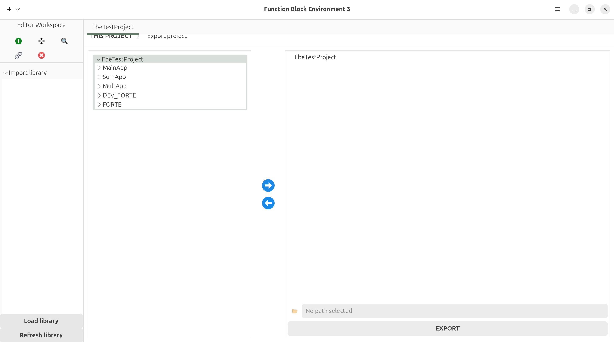

